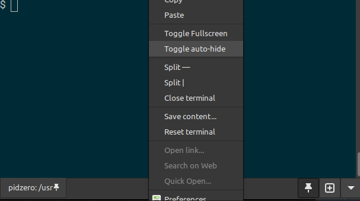

# Guake 3 README

[](https://github.com/Guake/guake/actions)
[](https://www.bountysource.com/teams/guake)
[](https://guake.readthedocs.io/en/stable/?badge=stable)
[](https://hosted.weblate.org/projects/guake/guake/)

## Introduction

Guake is a python based dropdown terminal made for the GNOME desktop environment. Guake's style of window is based on an FPS game, and one of its goals is to be easy to reach.

## Pin Terminal Feature

This fork enhances Guake with a visual indicator on the terminal tab when the existing "do-not-hide-on-lost-focus" functionality is enabled. This makes it easy to identify when guake is not in auto-hide mode. This can also now be toggled from the Guake context menu.


Additionally, a .deb package builder was added to the Makefile because I always like to have that option.  An sha256sum is included at build time so you can verify the package is authentic if you find it somewhere else on the web.

**Key Benefits:**
- **Visual Feedback**: Clear indication on tab that pin-mode is active
- **Screenshot-Friendly**: Perfect for taking screenshots of terminal content without the terminal hiding
- **Consistent State**: Synchronized pin state between hotkey, app button, and tab indicators
- **Easy Control**: Can "Toggle auto-hide" option in the terminal context menu

**How It Works:**
- Enable pin mode using the global hotkey (Ctrl+Shift+F1) or app pin button
- The active tab shows a pin icon when pin mode is active
- Guake stays visible even when focus is lost
- Toggle pin mode to restore normal hide-on-lose-focus behavior

**Pin Mode in Action:**


## Installation

### Pre-built Debian Package

Pre-built Debian packages (`.deb`) are available for easy installation on Debian/Ubuntu systems. 

**Download and install:**
```bash
# Download the latest package from GitHub releases
wget https://github.com/bitstrike/guake/releases/latest/download/guake_*.deb

# Install the package
sudo dpkg -i guake_*.deb
```

**Note**: This package includes all necessary dependencies and will install to the system-wide `/usr` directory.

**Package details and SHA256 checksums** are available on the [GitHub releases page](https://github.com/bitstrike/guake/releases).

## Building from Source

### Prerequisites

Install build dependencies on Debian/Ubuntu systems:
```bash
sudo apt install libgirepository1.0-dev python3-dev python3-gi libcairo2-dev pkg-config \
                 gir1.2-gtk-3.0 gir1.2-keybinder-3.0 libkeybinder-3.0-0 gir1.2-vte-2.91 \
                 gir1.2-wnck-3.0 gir1.2-notify-0.7 dh-make debhelper meson ninja-build
```

### Build Debian Package

To build your own `.deb` package with the Pin Terminal feature:

```bash
# Clone the repository
git clone https://github.com/bitstrike/guake.git
cd guake

# Build the Debian package
make deb
```

This will:
- Create a `.deb` package in the current directory
- Clean up any previous package files

### Install Your Built Package

```bash
# Install the package you just built
sudo apt install ./guake_*.deb
```

## Quick Installation Guide

Please refer to [Installation Guide](https://guake.readthedocs.io/en/latest/user/installing.html#system-wide-installation)

## What it looks like?


Drop down terminal on pressing <F12>

## Note when compiling from source

Do **NOT** use the Tarball packages automatically generated by GitHub on the Release pages. They won't work because one of the main components of Guake build system, PBR, requires the full Git history to be available when building from source. Note this does not impact source distribution packages you can download from Pypi.

**For this enhanced version**: Use the "Building from Source" section above to build a proper `.deb` package with the Pin Terminal feature included.

Original build from sources instructions are described on [this page of the Online Documentation](http://guake.readthedocs.io/en/latest/user/installing.html#install-from-source). Please read this carefully before opening an issue!

## Bugs? Information?

- Source Code available on [GitHub](https://github.com/Guake/guake/).
- Official Homepage: https://guake.github.io
- Online Documentation is hosted on [ReadTheDocs](http://guake.readthedocs.io/).
- If you are not a developer, you can still contribute to Guake by [improving its translations in your language](https://hosted.weblate.org/projects/guake/guake/). Guake users are welcome [to support Weblate](https://weblate.org/donate/) in providing this service for free for OpenSource Projects.

**Important note**: Do **NOT** use the domain guake.org, it has been registered by someone outside the team. We cannot be held responsible for the content on that web site.

This project was originally created by Gabriel Falcão, see: https://sourceforge.net/projects/guake-gnome-vte/
